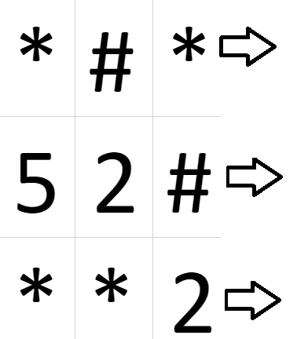
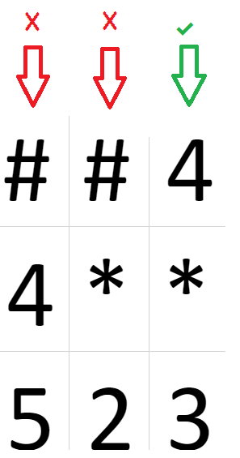
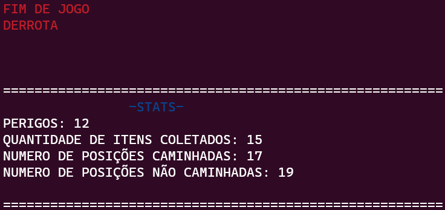
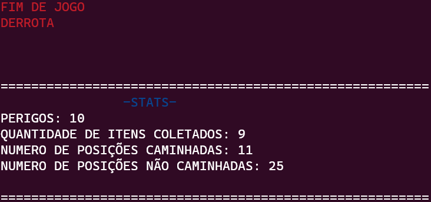
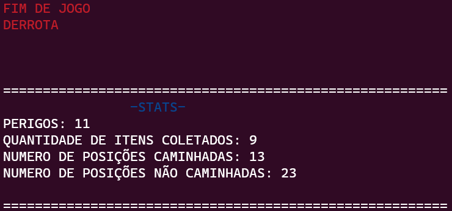

# Introdução: Labirinto Recorrente
 </br>
Esse Algoritimo tem como objetivo a simulação de um jogo em que, um garoto se movimente aleatoriamente em um conjunto de matrizes , que fazem um papel de "mapa" a ser caminhado. O caminhamento é feito de maneira Aleatória. A matriz possui 3 variações de posições, paredes são marcadas pelo caracter '#' em que o garoto não pode caminhar, areas perigosas são marcadas pelo caracter '*', e areas onde o garoto pode andar livremente são marcas por números que vão de 0 a 9, onde,a cada passo que ele realizar nessas areas livres ele coleta o "item" dessa posição, como exemplo a posição '2' se ele passar por essa posição, ela passará a conter o caracter '1'. A condição de vitoria é dada quando o garoto consegue percorrer todas as matrizes sem coletar nenhum item, sinalizando que coletou todos os itens no caminho, já, a condição de derrota é a vida do garoto chegar a 0, no inicio do jogo o garoto começa com 10 vidas , sendo esse o total de vidas possíveis, a cada 4 itens coletados consecutivamentes o garoto ganha mais uma vida.A condição de passagem para outra matriz é chegar na última coluna da matriz atual, sendo um processo cíclico **( Processo esquematizado na Fig.1 )**.A entrada do programa vem do arquivo "input.data" gerada pelo programa: <a href="https://github.com/mpiress/GenerateDataToMaze">GenerateDataToMaze</a>;</br>

# Arquivos Utilizados na execução do programa:
* src
  * ```main.c```: Estrutura principal do código.
  * ```functions.h```: Declaração de funções e bibliotecas utilizadas. 
  * ```functions.c```: Implementação das funções do programa.
* Dataset
  * ```input.data```: Arquivo com o input inicial do programa.
  * ```pathing.data```: Arquivo auxiliar criado, para aramazenamento das matrizes que que foram caminhadas.

# Inicializando variáveis e estruturas
## Atribuição de estrutura
A struct "player" (Declarada na linha 20- `functions.h`), tem como objetivo simular o jogador; ela possui as cordenadas x,y do jogador, além da sacola que abrigará os items coletados durante o caminho, possui também a vida do jogador.   
## Iniciando variáveis
A partir da leitura da primeira linha do arquivo ```input.data``` é possivel saber o tamanho das matrizes, e a quantidade de matrizes. Sendo possível inicializar a matriz com o tamanho lido. Também à a inicialização de um vetor que servirá para salvar todas as posições que foram andadas, afim de mais tarde calcular todas as posições caminhadas exceto as repetidas. O arquivo ```input.data``` é aberto inicialmente para leitura, e, o aquivo auxiliar ```pathing.data``` é aberto para escrita.
# Decisões de Implementação
## posições caminhadas
Para o calculo de posições caminhadas no total, foi criado um vetor para armazenar todas as posições caminhadas em uma matriz, incluindo posições repetidas, o vetor é da própria struct "player" onde armazena as cordenadas x e y da posição caminhada e na sacola armazena o numero da matriz que esta posição está; Afim de no final, ter a chamada da função `Checked_stances` que retorna a quantidade de posições caminhadas não repetidas.
## Posições não caminhadas
No calculo de posições que não foram exploradas se utilzou da função `Checked_stances`, onde justamente retorna as posição exploradas não repetidas, e, para as que não foram caminhadas é realizada a subtração das que foram caminhadas com o total de posições possiveis de serem caqminhadas em todas as matrizes (número de linhas * número de colunas * número de matrizes ), **considerando as paredes como posições não exploradas**. 
## Leitura
a leitura das matrizes é feita de maneira sequencial , com relação a disposição delas no aruivo `input.data`. Para quando o garoto atingir a condição de passar para a outra matriz. dentro da função `warp`, existe a função `Save_Maze`.-Localizada na Linha 270. `functions.c`;
Recebe a matriz que foi caminhada anteriormente e salva no arquivo auxiliar `pathing.data` quando o garoto estiver na ultima matriz, o arquivo principal `input.data` é fechado e aberto para escrita, fazendo com que todas os dados sejam reescritos, sendo assim o arquivo auxiliar é aberto para leitura, passando todas as matrizes previamente caminhas para o arquivo principal novamente, permitindo um novo caminhamento do garoto.
## Exibição
A cada passo realizado, há o chamado da função `timer` que exibe na tela a posição atual do garoto na matriz, além de sua vida, a posição antes e depois de ser consumida, se for o quarto item consecutivo que o garoto coletou é exibido a vida ganha, e, também se o garoto recebeu um dano é mostrado na tela. Após 6 segundos, a tela é apagada,e é mostrado mais um passo do garoto, foi adotada essa forma de exibição afim de visualizar melhor os passos realizados.
## Seleção de Posições
* Não há o tratamento do caso de o garoto estar cercado de paredes.
* Na passagem de matriz em matriz, não há o tratamento do caso toda a primeira linha ser composta de paredes.
## Condição de Derrota e Vitória
* Condição de derrota
  * Se a vida do jogador chegar a 0, é considerado que ele perdeu.
* Condição de vitória
  * Quando há o percorrimento de um caminho inteiro (andar por todas as matrizes) sem coletar nenhum item, é considerado que o garoto coletou todos os itens, sendo essa a condição de vitória.

# Lógica Implementada
## Caminhamento em uma matriz 
Na função `rand_stance`(Linha 4-```functions.c```) é gerado um número aleatório entre 0 e 7 para a aescolha da próxima posição do garoto;
<li>0-esquerda.</li>
<li>1-direita.</li>
<li>2-cima.</li>
<li>3-superior esquerda.</li>
<li>4-superior direita.</li>
<li>5-inferior direita.</li>
<li>6-inferior esquerda.</li>
<li>7-baixo.</li>
a escolha se dá através de um switch case;  Caso a posição escolhida seja uma parede, não há a mudaça de posição antes realizada e há uma nova chamada da função, até achar uma posição possivel de se caminhar ('*' ou número qualquer). Se a posição é possivel de caminha , a posição do garoto é trocada para a nova, e há a chamada da função `update_stance` que possuí a tarefa de fazer as verificações de dano,coleta de item e se a posição for '0'. Caso a posição for uma area perigosa, há a subtração de uma vida do garoto; Caso for um item, há a adição de um item na sacola do garoto e há a subtração do número nessa respectiva posição.</br>

## Passagem de matriz em matriz.
Caso a posição atual do garoto seja na ultima coluna da matriz **(Fig.1)**. é chamada a função `warp` que tem como objetivo "teletransportar" o garoto para a proxima matriz, essa passagem de matriz em matriz é sempre de maneira cíclica ou seja da 1 para a 2, da 2 para a 3, e, finalmente da 3 para 1 novamente, sempre repetindo essa sequência, até a condição de vitória ou de derrota serem atingidas. Cada vez que passa para uma nova matriz o garoto é  "teletransportado" para a primeira posição possivél de ser caminhada na primeira linha da nova matriz **( Processo esquematizado na Fig.2 )** e o processo é realizado pela função `new_stance`(linhas 248-257-`functions.h`).</br>


</br>

### Matriz em Matriz(Fig.1)

</br>

### Matriz em Matriz(Fig.2)

## Calculo dos status finais do jogador
* Perigos totais enfrentados.
  * A cada perigo, que o garoto enfrenta, a um incremento em uma variavel inteira, que contabiliza o total de perigos enfrentados, no final é impresso na tela o valor dessa variavel.
* Quantidade de itens coletados
  * Para descobrir esse valor, basta ver a quantia que está dentro da sacola do jogador.
* Posições caminhadas e não caminhadas, já foram especificadas no tópico: <u>Decisões de Implementação</u>

# Resultados
Ao atingir ou a condição de vitória ou a condição de derrota, será impresso na tela os status do garoto, com os seguintes resultados:
Logo acima da impressão dos status é dito se o garoto venceu ou perdeu.
* Perigos totais enfrentados.
* Quantidade de itens coletados
* Número total de posições caminhadas (não repetidas).
* Número total de posições não caminhadas.

# Exemplo de execução
Para esse exemplo, A função `timer` foi desativada, afim de minimizar o tempo gasto na impressão de passo a passo.**será mostrado os status do jogador**, Como exemplo de entrada , possuimos 4 matrizes de tamanho 3x3 no arquivo `input.data`.
## Entrada.
*input.data*
| 3 | 3 | 4 |
|---|---|---|
| * | # | * |
| 5 | 2 | # |
| * | * | 2 |
|   |   |   |
| 4 | * | * |
| * | # | * |
| 2 | # | 3 |
|   |   |   |
| 2 | 4 | * |
| 4 | 1 | * |
| 2 | * | * |
|   |   |   |
| # | # | 4 |
| 4 | * | * |
| 5 | 2 | 3 |
## Saída.
<div>
Exemplo de saida.1:</br>

</div>
<div>
Exemplo de saida.2:</br>

</div>
<div>
Exemplo de saida.3:</br>

</div>

# Conclusões
## Analise de Resultados.
Como foi possível analisar nos *Exemplos de saída* , o garoto perdeu em todos os casos exemplo. O que nos leva a conclusão que a maneira de caminhar aleatoriamente sobre a matriz não é eficaz, uma vez que a condição de vitoria é raramente atingida. Comparando com o último trabalho realizado: <a href="https://github.com/joaopedrofreitas/Greedy-Algorithm">Greedy Algorithm</a>, com a forma aleatória de percorrimento não é possivel traçar um custo definido, uma vez que, a cada execução há novos resultados para uma mesma base de dados, dependendo do fator "sorte" para a obtenção de um resultado satisfatório (condição de vitoria). Levando isso em conta, comparando com trabalhos realizados anteriormente, a maneira aleatória de percorrimento é extremamente ineficaz, dependendo do acaso para obtenção de um resultado satisfatório.
## Análise de custo computacional.
Como foi dito, para uma mesma base de dados, a cada execução, obtemnos um resultado diferente.E, na maioria dos resultados não conseguiremos a condição de vitoria.Para a estimativa do custo computacional, podemos estipular casos onde, todos os valores gerados aleatoriamente pela função `rand_stance` vão para a direita ou para diagona inferior direita. Porém, no caso de uma execução padrão, onde a chance do valor aleatorio ser o mesmo sempre, é ínfima, é impossivel analisar um custo computacional, para todo o programa.

# Compilção e Execução
<p>
    <i>Este código possui um arquivo Makefile que facilita a compilação e execução do programa</br>As diretrizes de execução deste
    Make file são:<i>
    <table border="1">
      <tr><td><u>make clean</u></td> <td>Apaga a última compilação realizada contida na pasta build</td></tr>
      <tr><td><u>make</u></td> <td>Executa a compilação do programa utilizando o gcc, e o resultado vai para a pasta build.</td></tr>
      <tr><td><u>make run</u></td> <td>Executa o programa da pasta build após o programa já estar compilado </td></tr>
    </table>
    <i>Para a execução do programa utilize <u>make</u> para realizar a compilação e logo após utilize <u>make run</u> para executar o programa</i>
</p>

# Referencias
CORMEN, Thomas H. et al. Algoritmos: Teoria e Prática. 3. ed. Rio de Janeiro: Elsevier, 2012. Capítulo 5.

# Autor
E-mail: joaopedrofdpd2205@gmail.com</br>
3° Período-2023-Engenharia de Computação-CEFET-MG
